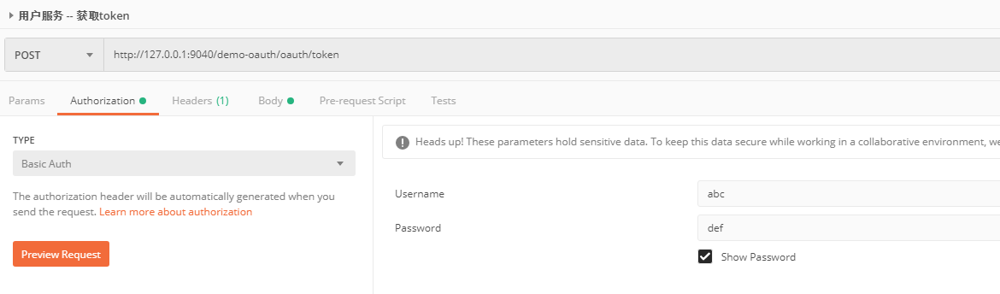
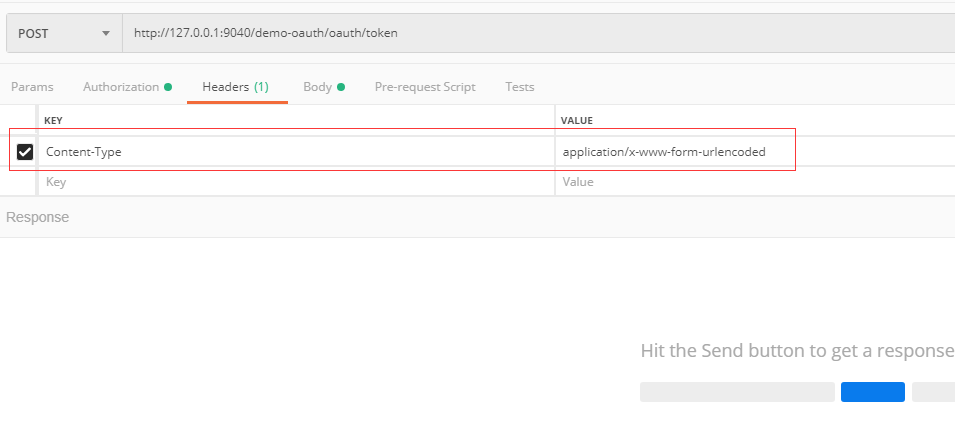
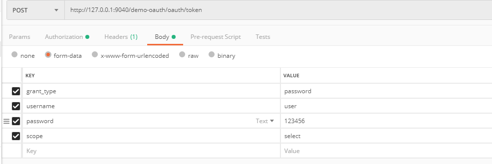
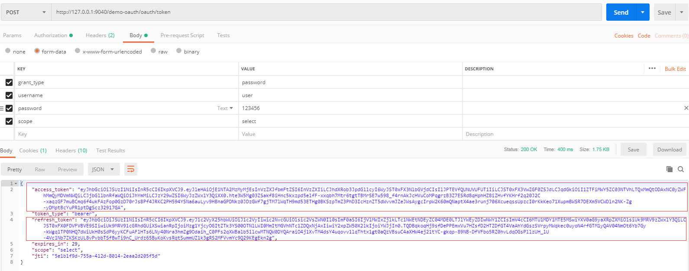
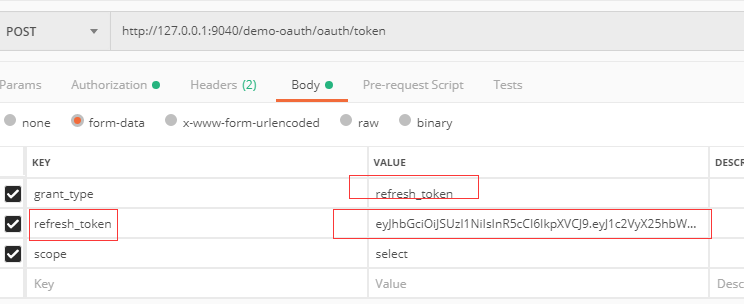
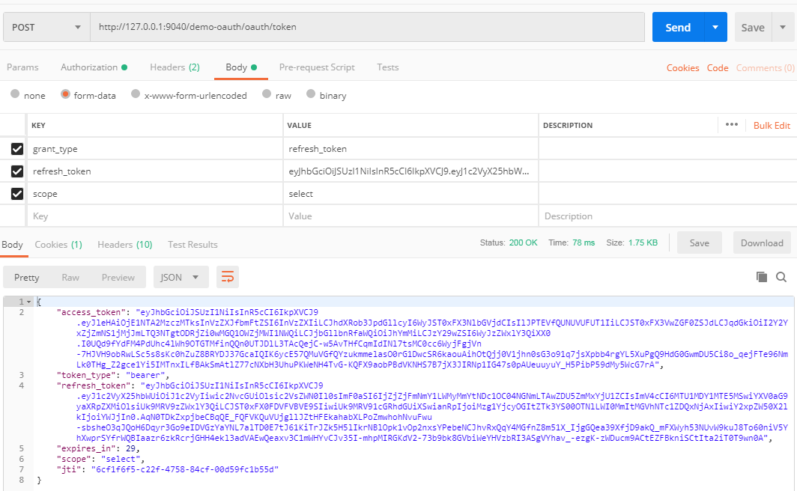

# cloud-demo

- ```cloud-demo```是一个微服务的demo项目，提供了一个微服务间身份认证授权的解决思路的实现，目前主要采用的jwt token的解决方案。 

### cloud-demo子项目介绍

| 模块名称 | 说明 |
| :---: | :---: |
| cloud-demo-common | 一个提供给所有模块使用的通用模块 |
| cloud-demo-eureka | 微服务模块 - erueka服务 |
| cloud-demo-oauth | 微服务模块 - 用户服务,关于用户的登录获取jwt token 以及刷新 jwt token|
| cloud-demo-good | 微服务模块 - 商品服务 |
| cloud-demo-order | 微服务模块 - 订单服务 |
| cloud-demo-zuul | 微服务模块 - 网关服务 |

### 项目的启动方式
|  | 
| :--- | 
| 启动eureka集群服务，使用不同的参数 --spring.profiles.active=service1 和 --spring.profiles.active=service2 启动两次即可| 
| 启动其他的微服务模块 | 

### 获取token的访问地址
| 名称 | 访问地址 |
| :---: | :---:|
| 获取刷新用户token|[http://127.0.0.1:9040/demo-oauth/oauth/token](http://127.0.0.1:9040/demo-oauth/oauth/token) | 

## 获取token的正确姿势(请求方式为post)
### 1. 配置authorization请求头 

### 2. 设置请求方式为 表单提交

### 3. 填写表单数据

### 4. 拿到jwt token 以及 刷新 jwt的token


## 刷新token的正确姿势(请求方式为post)
### 1. 配置authorization请求头 

### 2. 设置请求方式为 表单提交

### 3. 填写表单数据

### 4. 获取刷新后的jwt token 以及 刷新 jwt的token


## 新增微服务后如何启用身份认证及授权，以及服务间的调用如何无感知的启用身份认证及授权
### 引入依赖
```xml
<dependency>
    <groupId>com.whb.cloud.demo</groupId>
    <artifactId>cloud-demo-common</artifactId>
    <version>${project.version}</version>
</dependency>
```
### 添加指定注解 及相应的配置
```java
@SpringBootApplication
@EnabledClientSecurity
@EnableEurekaClient
public class CloudDemoOrderApplication {
    public static void main(String[] args) {
        SpringApplication.run(CloudDemoOrderApplication.class, args);
    }

    @Bean
    @Primary
    @LoadBalanced
    public RestTemplate restTemplate(){
        RestTemplate restTemplate = new RestTemplate();
        restTemplate.getMessageConverters()
                .add(0, new StringHttpMessageConverter(Charset.forName("UTF-8")));
        restTemplate.setInterceptors(Collections.singletonList(new UserAgentInterceptor()));
        return restTemplate;
    }
}
```

```java
/**
* @EnabledClientSecurity
* 这个是开启客户端的用户身份授权认证(采用shiro实现)
*/
```

```java
/**
* restTemplate.setInterceptors(Collections.singletonList(new UserAgentInterceptor()));
* 这个是当使用restTemplate 请求微服务的数据时候，可以无感知的添加上jwt token
*/
```
 


